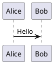

# PlantUML Lite — Obsidian.md plugin

A lightweight, zero-config PlantUML plugin for [Obsidian.md](https://obsidian.md/).

Renders `plantuml` code blocks instantly using the official [PlantUML JavaScript engine](https://plantuml.github.io/plantuml/js-plantuml/index.html) — no Java, no server, no setup required.

## Features

- [x] Zero configuration
- [x] Renders PlantUML diagrams directly in your notes
- [x] Export diagrams to SVG

## Example



## Development

Install dependencies

```sh
bun install
```

Start development

```sh
bun dev
```

Build the plugin

```sh
bun run build
```
