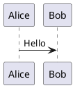

# PlantUML plugin for Obsidian.md

This plugin renders `plantuml` code blocks in Markdown files within [Obsidian.md](https://obsidian.md/) using the [PlantUML JavaScript rendering engine](https://plantuml.github.io/plantuml/js-plantuml/index.html).

## Features

- [x] Render PlantUML diagrams directly in your notes
- [x] Export diagrams as SVG

## Example



## Development

Install dependencies

```sh
bun install
```

Start development

```sh
bun dev
```

Build the plugin

```sh
bun run build
```
